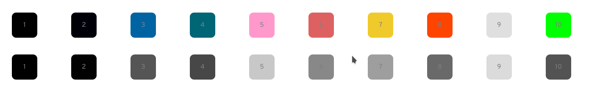

This plugin allows to convert the original colours of [Suru++ 25](/gusbemacbe/suru-plus) to Telinkrin colours, as [Suru++ Telinkrin](/gusbemacbe/suru-plus-telinkrin).

## **How does it work?**

The SVG Filter will show you how to use `feComponentTransfer` to create a colour filter effect, i.e., Telinkrin colour filter effect.

According to [Soueidan (2019)][1], ‘the `feComponentTransfer` primitive allows you to modify each of the R, G, B and A components present in a pixel. In other words, feComponentTransfer allows the independent manipulation of each color channel, as well as the alpha channel, in the input element.’

To recreate the colour effect in SVG, you need to desaturate firstly, using the `<feColorMatrix>` filter primitive. The `feColorMatrix` provides a colour matrix that specifies the amount of red, green, and blue. By providing equal amounts of these three components, the matrix is created to convert into a grayscale version of itself:

```xml
<svg height="0">
  <filter id="telinkrin" x="-10%" y="-10%" width="120%" height="120%" filterUnits="objectBoundingBox" primitiveUnits="userSpaceOnUse" color-interpolation-filters="sRGB">
  	<feColorMatrix type="matrix" 
       values=" 0.33 0.33 0.33 0 0
                0.33 0.33 0.33 0 0
                0.33 0.33 0.33 0 0
                0    0    0    1 0" 
    in="SourceGraphic" result="colormatrix"/>
  </filter>
</svg>
```

In the following result, the original colours of Suru++ were converted into grayscale colours by the middle of the `feColorMatrix` filter:



In the `feColorMatrix`, understand what these three 0.33s with three 0 alphas and last two 0s, with one 1 and another 0 alphas:

```
R =   0.33 0.33 0.33 0 0
G =   0.33 0.33 0.33 0 0
B =   0.33 0.33 0.33 0 0
A =   0    0    0    1 0" 
```

But still, what are 0.33s and 0s? 0.33s are grey and 0s are black. But I checked that in colour picker and it does not exist. Well, it is a discrete mathematics matrix. I explain the matrix:

<br>


Then it is `rgba(84, 84, 84)`, you can check this real RGBA in the colour picker, you will see that it is exactly grey (`#545454`), that is a grayscale colour which gives the filter effect.

As for 0s, as you know very well that it is easy, $RGBA = \begin{bmatrix} 0 & 0 & 0 & 1 \end{bmatrix}$ gives `rgba(0, 0, 0, 1)` which totally black and non-transparent (alpha) and $RGBA = \begin{bmatrix} 0 & 0 & 0 & 0 \end{bmatrix}$ gives `rgba(0, 0, 0, 0)` which is totally black, but totally transparent (alpha).

Now that the original colours of Suru++ are essentially made of a gray gradient, we want to create a Telinkrin gradient map to map the gray gradient to. 

Suppose we want to use the following three colours for our Telinkrin effect:


## References

[1]: https://tympanus.net/codrops/2019/02/05/svg-filter-effects-duotone-images-with-fecomponenttransfer/  "SVG Filter Effects: Duotone Images with <feComponentTransfer> "