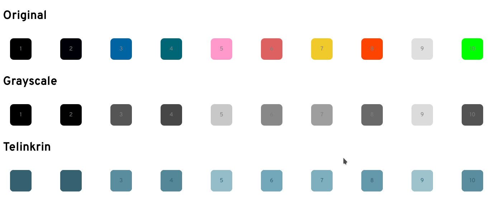

This plugin allows to convert and overwrite the original colours of [Suru++ 25](/gusbemacbe/suru-plus) to Telinkrin colours of as [Suru++ Telinkrin](/gusbemacbe/suru-plus-telinkrin).

## **How does it work?**

The SVG Filter will show you how to use `feComponentTransfer` to create a colour filter effect, i.e., Telinkrin colour filter effect.

According to <a href="soueidan">Soueidan (2019)</a>, ‘the `feComponentTransfer` primitive allows you to modify each of the R, G, B and A components present in a pixel. In other words, feComponentTransfer allows the independent manipulation of each color channel, as well as the alpha channel, in the input element.’

To recreate the colour effect in SVG, you need to desaturate firstly, using the `<feColorMatrix>` filter primitive. The `feColorMatrix` provides a colour matrix that specifies the amount of red, green, and blue. By providing equal amounts of these three components, the matrix is created to convert into a grayscale version of itself:

```xml
<svg height="0">
  <filter id="telinkrin" x="-10%" y="-10%" width="120%" height="120%" filterUnits="objectBoundingBox" primitiveUnits="userSpaceOnUse" color-interpolation-filters="sRGB">
  	<feColorMatrix type="matrix" 
       values=" 0.33 0.33 0.33 0 0
                0.33 0.33 0.33 0 0
                0.33 0.33 0.33 0 0
                0    0    0    1 0" 
    in="SourceGraphic" result="colormatrix"/>
  </filter>
</svg>
```

In the following result, the original colours of Suru++ were converted into grayscale colours by the middle of the `feColorMatrix` filter:


In the `feColorMatrix`, understand what these three 0.33s with three 0 alphas and last two 0s, with one 1 and another 0 alphas:

```
R =   0.33 0.33 0.33 0 0
G =   0.33 0.33 0.33 0 0
B =   0.33 0.33 0.33 0 0
A =   0    0    0    1 0" 
```

But still, what are 0.33s and 0s? 0.33s are grey and 0s are black. But I checked that in colour picker and it does not exist. Well, it is a discrete mathematics matrix classified as `tableValues`. I explain the matrix:

<br/>


Then it is `rgba(84, 84, 84)`, you can check this real RGBA in the colour picker, you will see that it is exactly grey (`#545454`), that is a grayscale colour which gives the filter effect.

As for 0s, as you know very well that it is easy,  gives `rgba(0, 0, 0, 1)` which totally black and non-transparent (alpha) and  gives `rgba(0, 0, 0, 0)` which is totally black, but totally transparent (alpha).

Now that the original colours of Suru++ are essentially made of a gray gradient, we want to create a Telinkrin gradient map to map the gray gradient to. 

As Soueidan said, suppose we want to use the following three colours for our Telinkrin effect:


These three colours will be used to create a gradient map:


...that we are going to map our grayscale map to.

Soueidan says that, in order to use these colours in `feComponentTransfer`, we need to get the values of the R, G, and B channels of each colou. Since `tableValues are provided` in fractions, we will need to convert the RGB values to fractions. Colour values are usually in the range [0, 255]. To convert these values to fractions, we need to divide them by 255.

For example, 1st colour (`#356170`) has the following RGB values:


Converted to fractions, these values are now equal to:


Similarly, the 2nd colour (`#6da5b7`) values resolve to:


And 3rd colour (`#b2ced6`):


As we already have these three colour values, let us create our gradient map, applying to `tableValues`, to create a range:

```xml
<feComponentTransfer in="colormatrix" result="componentTransfer">
  <feFuncR type="table" tableValues="0.21 0.43 0.7"   />
	<feFuncG type="table" tableValues="0.38 0.65 0.81"  />
	<feFuncB type="table" tableValues="0.44 0.72 0.84"  />
	<feFuncA type="table" tableValues="0    1.00 1.00"  />
</feComponentTransfer>
```

Understand now how the SVG filter works and is applied:


1. Although 0.33s and 0s are grey and black, they are considered grayscale colours, but they also mean brightness, hue and saturation to distinguish the original colours. 
2. As we want to ‘telinkrise’ the original colour `#00ff00` to #5a8d9e, we mix these `feColorMatrix` and `feComponentTransfer` colours to convert. 

Here is the result:



Here is the full SVG filter codes:

```xml
<svg height="0">
  <filter id="telinkrin" x="-10%" y="-10%" width="120%" height="120%" filterUnits="objectBoundingBox" primitiveUnits="userSpaceOnUse" color-interpolation-filters="sRGB">
  	<feColorMatrix type="matrix" 
       values=" 0.33 0.33 0.33 0 0
                0.33 0.33 0.33 0 0
                0.33 0.33 0.33 0 0
                0    0    0    1 0" 
    in="SourceGraphic" result="colormatrix"/>
  	<feComponentTransfer in="colormatrix" result="componentTransfer">
      <feFuncR type="table" tableValues="0.21 0.43 0.7"   />
  		<feFuncG type="table" tableValues="0.38 0.65 0.81"  />
  		<feFuncB type="table" tableValues="0.44 0.72 0.84"  />
  		<feFuncA type="table" tableValues="0    1.00 1.00"  />
    </feComponentTransfer>
  	<feBlend mode="normal" in="componentTransfer" in2="SourceGraphic" result="blend"/>
  </filter>
</svg>
```

## Demo 1

You can check the HTML file containing the SVG codes: [Demo 1](demo1.html)

### Advantages

This SVG filter distinguishes two different black shapes, as `#000000` and `#000009` and converts to different Telinkrin colours.

As you want to create your icons theme according to three shapes of blue, you can use this SVG filter to overlay quickly all icons without having to replace more than 850 colours for others colours. 

### Disadvantages

As SVG filter does not convert the original colours to real hexadecimal codes of Telinkrin colours, then you have to pick colour by colour to copy the hexadecimal code to the list of colours for overwriting the original colours of Suru++.

KDE does not support SVG filter feature, so you have to convert SVG of all icons to PNG for KDE. 

## Demo 2

As we want to get rid of colour-picking colour by colour and know KDE does not support it, we have to overwrite or replace all colours of all Suru++ icons, using `sed --in-place --follow-symlinks -e 's/original_colour/telinkrin_colour/g`, we created JavaScript codes that will use HSL of Telinkrin colour to convert the original colours to real hexadecimal codes once in a while, so we can copy all hexadecimal codes once in a while, without having to colour-pick colour by colour. The original colours are converted according to the **light** of Telinkrin HSL. Here is the [demo 2](demo2.html)

### Disadvantages

Unfortunately JavaScript codes allow only **one** of three Telinkrin colours, so we have to pick one, and as according to the **light** of Telinkrin HSL, it does not distinguish two different black shapes `#000000` and `#000009` and converts to the **same** Telinkrin colour. It will prejudice the icons. 

## Demo 3

There are CSS filters as `mix-blend-mode: color` and `filter: grayscale(100%);`.

It is important that `background: #6DA5B7; mix-blend-mode: color` works only with images, and not with `div` with the tag `background-color: #00f00`. 

As we want to use `filter` to give Telinkrin effect, we need to convert the colour to CSS filter, then we refer to [How to transform black into any given color using only CSS filters](https://stackoverflow.com/a/43960991) whose example of codes provided by MultiplyByZer0. Apply the Telinkrin color RGB (`rgb(109, 165, 183)`) in the [demo 4](demo4.html). 

Click to compute filters, we get `filter: invert(69%) sepia(19%) saturate(676%) hue-rotate(148deg) brightness(86%) contrast(90%);`, then like:

```css
.telinkrin 
{
  -webkit-filter: invert(69%) sepia(19%) saturate(676%) hue-rotate(148deg) brightness(86%) contrast(90%);
  -moz-filter: invert(69%) sepia(19%) saturate(676%) hue-rotate(148deg) brightness(86%) contrast(90%);
  -o-filter: invert(69%) sepia(19%) saturate(676%) hue-rotate(148deg) brightness(86%) contrast(90%);
  -ms-filter: invert(69%) sepia(19%) saturate(676%) hue-rotate(148deg) brightness(86%) contrast(90%);
  filter: invert(69%) sepia(19%) saturate(676%) hue-rotate(148deg) brightness(86%) contrast(90%);
}
```

Converting the original colours to produce Telinkrin colours, and we also must add `grayscale(100%)` to it. Here is the [demo 3](demo4.html).

### Disadvantages

You can see that the Telinkrin colours of demo 1 and the 1st colour of demo 4 are similar, but some colours are different. It is impossible apply three colours in the same filter. Them demo 1 is very accurate. 

Like demo 1, it does not convert to real hexadecimal colours, so you have to colour-pick colour by colour. The demo 2 must be useful so you can copy quickly all hexadecimal codes, but due to HSL of Telinkrin colour, two or three black shapes are converted to the same hexadecimal code, what is bad for the icons. 

## References

<span id="soueidan">
  <p>SOUEIDAN Sarah, "SVG Filter Effects: Duotone Images with `<feComponentTransfer>`", https://tympanus.net/codrops/2019/02/05/svg-filter-effects-duotone-images-with-fecomponenttransfer/, February 2019, (accessed February 11, 2019)</p>
</span>